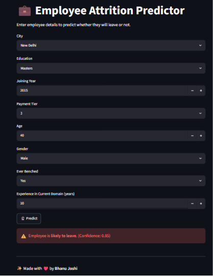

## 💼 Employee Attrition Predictor

🚀 **Live Demo:** https://employee-leave-prediction.streamlit.app/

## 📸 Preview

<p align="center">
  
</p>

---

This Machine Learning + Streamlit application predicts whether an employee is likely to leave a company based on employee-related information.

The project was built to practice machine learning model development, deployment, and building interactive web applications using Streamlit.

---

## ✨ Features

- Predicts employee attrition based on user input
- Interactive and easy-to-use Streamlit interface
- Displays prediction results instantly
- Deployed on Streamlit Community Cloud

---

## 🛠️ Tech Stack

- Python
- Streamlit
- XGBoost
- Scikit-learn
- Pandas
- NumPy
- Joblib

---

## ⚙️ Installation

```bash
git clone https://github.com/bhanu-joshi01/Employee-Attrition-Predictor-App.git
cd Employee-Attrition-Predictor-App
pip install -r requirements.txt
streamlit run app.py
```

---

## 👨‍💻 Author

Made with ❤️ by **Bhanu Joshi**

If you found this project useful, consider giving it a ⭐.
